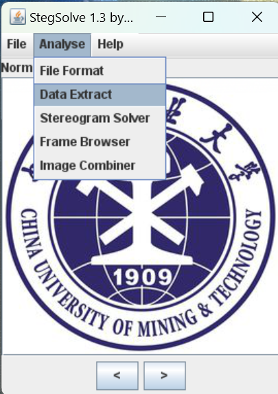
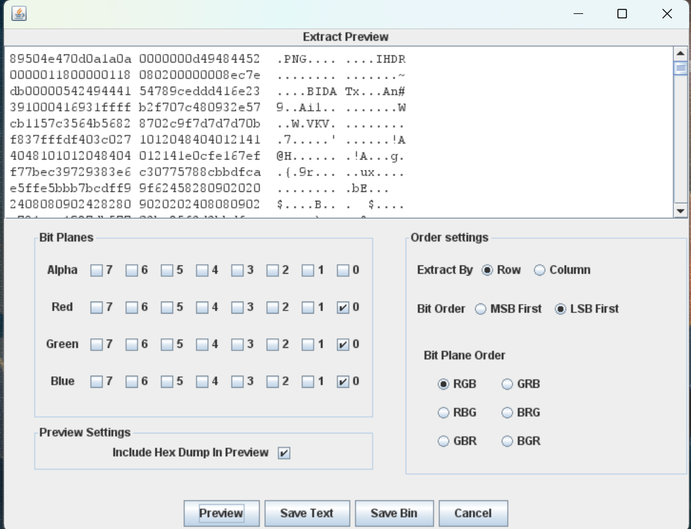
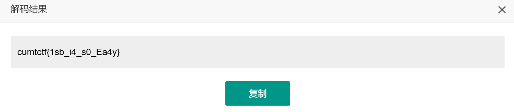
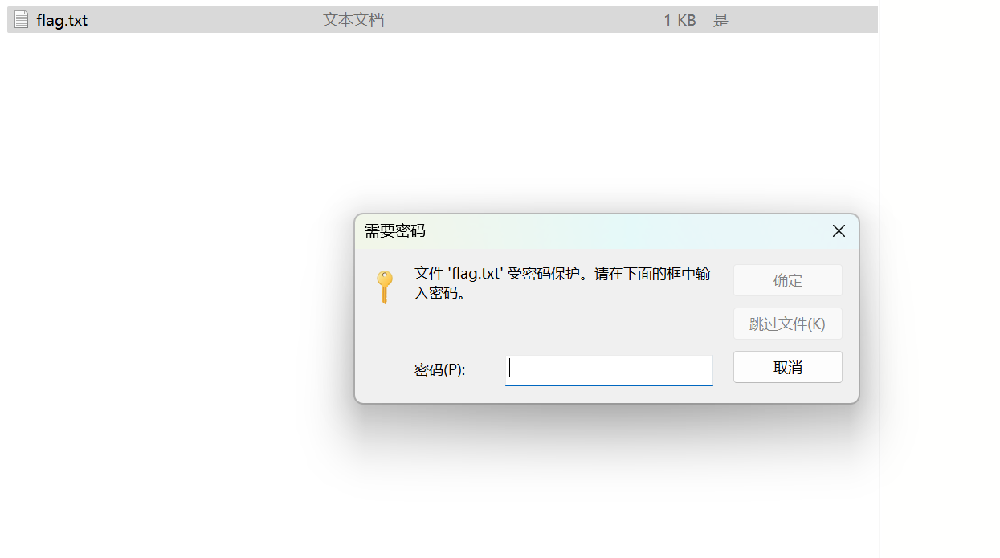
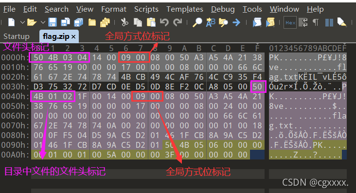
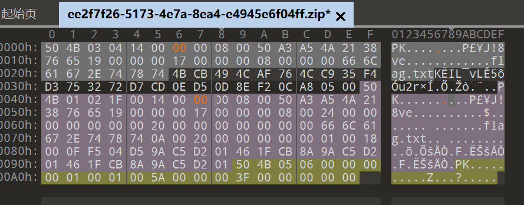
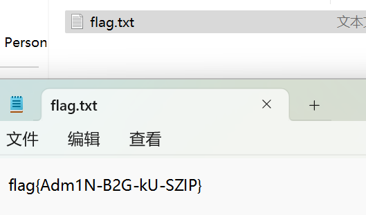

# CTF笔记
## 一.隐写
### 1.二维码
---
下载文件解压里面是二维码的图片 
 
扫描出来 
 
写的secret is here,但不是flag,所以可能是用隐写技术隐藏了信息，放进kali用foremost看看 
 
foremost出来一个zip文件，里面有4number.txt，需要密码，发现也不是secret is here，看wp发现要爆破，4number代表4位数字 
 
把7639输进去打开txt 
 
包上flag{}发现不对，把CTF换成flag就对了 

### 2.大白
 
下载题目提供的文件，发现是一张大白的图片 
 
根据题目提示“是不是屏幕太小了”推测图片大小被修改了，用010editor打开 
 
发现提示CRC Mismatch（最下面黄色条） 
***
**知识点.CRC校验：*对一张正常的图片，通过修改其宽度或者高度隐藏信息，使计算出的CRC校验码与原图的CRC校验码不一致；windows的图片查看器会忽略错误的CRC校验码，因此会显示图片，但此时的图片已经是修改过的，所以会有显示不全或扭曲等情况，借此可以隐藏信息。*** 
***
 
找到宽高位置，把高度256改为和宽度一样的679，保存图片后再次打开 
 
多出来一大块透明区域显然调多了（ 
但无所谓答案已经出来了（ 
把flag{He1l0_d4_ba1}交上去就好啦 

### 3.LSB
下载图片 
 
用之前的方法都无效，只能去找wp，发现题目LSB本身就是提示
***
**知识点.LSB隐写：*LSB即为最低有效位（Least Significant Bit），图片中的图像像素一般是由RGB三原色（红绿蓝）组成，每一种颜色占用8位，取值范围为0x00~0xFF，RGB颜色分量的最低二进制位也就是最低有效位（LSB），人类的眼睛不会注意到修改前后的变化，每个像数可以携带3比特的信息。由于是最低位隐写，所以应当提取Red，Green，和Blue的0通道信息***
***
用StegSolve打开图片，在Analyse中选择Data Extract 
 
打开后勾选Red，Green，和Blue的0通道后预览 
 
发现开头结尾都没有文本隐写，推测是图片隐写，选择Save Bin导出图片为1.png 
 
发现是一个二维码，扫描得到flag
 
提交flag{1sb_i4_s0_Ea4y}

### 4.zip伪加密
下载压缩包之后发现需要密码，唯一的提示是题干的伪加密 
 

***
**知识点.伪加密：*伪加密是在文件头的加密标记位做修改，0000代表未加密，0900代表加密，进而再打开文件时识被别为加密压缩包*** 
 
***一般的伪加密会将目录文件的文件头中，也就是将0102后面的全局方式位标记0000改为0900从而达到被识别为加密文件但又无密码的效果，更逼真的伪加密是将0304后面的全局方式位标记也改为0900*** 
***
所以为了将伪加密改为未加密，用010editor打开zip文件，将两处0900都改回0000 
 
保存后压缩包就没有密码可以直接打开了
 
最后提交flag{Adm1N-B2G-kU-SZIP}！
## 二.流量分析与取证
### 1.大流量分析
#### (1)

 
下载题目提供的流量包 
 
确实大  好几个G（  
用小鲨鱼wireshark打开第一个文件 
因为要查找黑客的ip，所以在统计中找到ipv4的数据，然后查看all adress 
 
把count从大到小排列，第一个占比57%的最活跃的ip大概率就是黑客的。 
 
把flag{183.129.152.140}提交上去就ok了 

#### (2)
 
还是刚才那个流量包，用小鲨鱼打开 
因为要查找黑客的邮箱，所以筛选出SMTP的协议 
 
发现红圈里面有MAIL FROM一个邮箱，并且后面标注了Sender，推测这个就是黑客发来邮件的邮箱。 
 
把flag{xsser@live.cn}提交上去就ok了 

#### (3)
 
看别人的wp似乎是道价值不大的烂题（ 
似乎直接搜索phpinfo逻辑不强？不懂 以后懂了再来补（ 
 
 

### 2.菜刀666
 
下载文件后解压，里面有.pcapng的文件，用小鲨鱼打开 
中国菜刀是一个webshell管理工具，一般用POST进行上传，所以在小鲨鱼的过滤器中输入http.request.method==POST进行过滤 
 
追踪一下tcp流，在第七个流中发现可疑数据 
 
以FFD8开头，去看一下结尾 
 
是FFD9,说明这是一个jpg文件 
用010editor分析，新建一个16进制文件 
 
把很长的16进制复制粘贴进来，一定要ctrl+shift+v，否则粘贴过来就不是要分析的16进制了 
 
把文件导出，另存为jpg文件，打开图片 
 
交上去发现不是flag，所以推测这是某个压缩包的解压密码 不过别人的wp也说能从TCP流里的这个看出来有加密的文件 
 
去kali用foremost分离一下看看 
第一遍提醒我output文件夹有东西所以不行，就去清理了一下，然后就出来东西了 
 
去output文件夹里找一下分离出来的文件 
 
发现是一个需要解压密码的zip文件，把图片里的密码输进去 
 
把flag{3OpWdJ-JP6FzK-koCMAK-VkfWBq-75Un2z}交上去就ok了 

