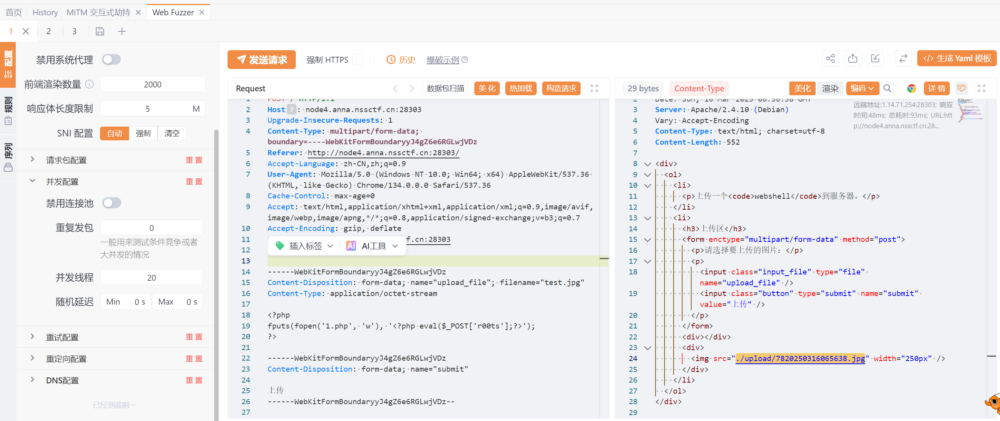
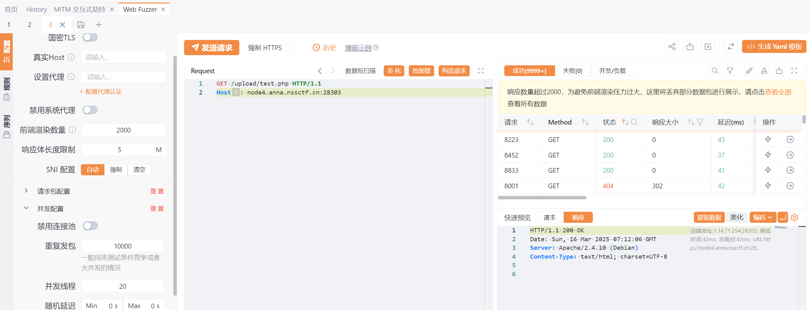
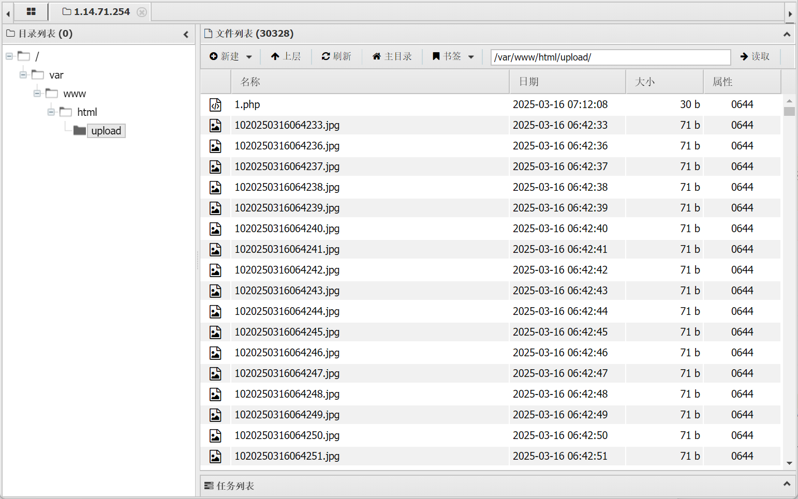
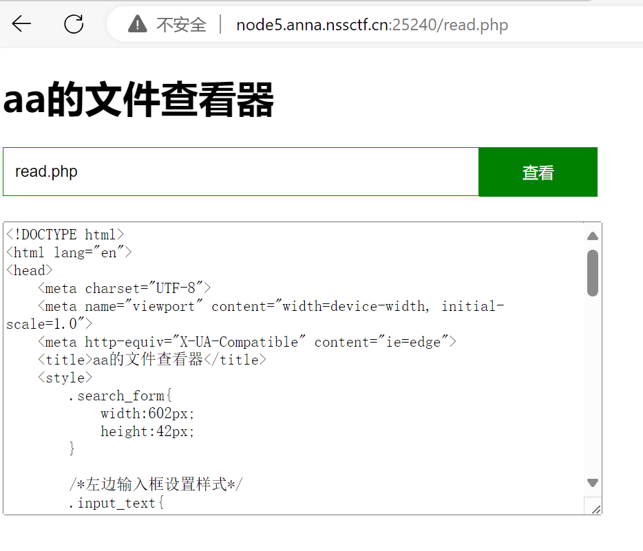

# CUCCTF训练2025 [03-05 ~ 03-11]
# 第一部分
## 本期主题关键词
图片隐写，音视频隐写，流量分析，电子取证，AI
## 本周题目

- [[SWPU 2019]神奇的二维码](https://www.nssctf.cn/problem/39)

- [[ccbciscn 2024]WinFT_1](https://github.com/CTF-Archives/2024-ccbciscn/tree/main )

- [[ccbciscn 2024]WinFT_2](https://github.com/CTF-Archives/2024-ccbciscn/tree/main)

- [[ccbciscn 2024]WinFT_5](https://github.com/CTF-Archives/2024-ccbciscn/tree/main)
### 神奇的二维码
图片binwalk出来一堆东西<br>
<br>
<br>
encode.txt里明显是base64<br>
<br>
解密得到asdfghjkl1234567890，发现这个是看看flag的解压密码，里面就是图片，已经被walk出来了<br>
flag.doc里有很长的base64<br>
<br>
解码多次后得到comEON_YOuAreSOSoS0great，发现这个是18394的解压密码，解压出MP3文件<br>
<br>
听到摩斯密码<br>
用audacity打开查看<br>
<br>
破译得到morseisveryveryeasy，包上NSSCTF{}提交<br>
注意：摩斯密码不区分大小写，提交flag时需多尝试不同大小写<br>

### WinFT_1
**某单位网管日常巡检中发现某员工电脑（IP：192.168.116.123）存在异常外连及数据传输行为，随后立即对该电脑进行断网处理，并启动网络安全应急预案进行排查。受控机木马的回连域名及ip及端口是（示例：flag{xxx.com:127.0.0.1:2333}）**

拿到一个虚拟机的文件

用vmware打开虚拟机，因为需要木马的回连域名及ip及端口，所以用netstat看一下网络状态

发现有一个状态为SYN_SENT的连接，比较可疑，用-n查看他的ip地址

再打开火绒剑的网络模块确认一下

的确有一个安全状态未知的进程在和刚刚看到的外部地址建立连接，推测这就是木马的回连ip

得到flag{miscsecure.com:192.168.116.130:443}

### WinFT_2
**找出受控机启动项中隐藏flag**
根据提示启动项，可以用taskschd.msc检查计划任务程序

在这个DriverUpdate的描述中找到了flag，base64解码

得到的疑似ascii编码，写一个python程序，利用正则表达式提取其中的数字并转化为字符输出
```python
import re

# 原始字符串
text = "&#78;&#105;&#99;&#101;&#65292;&#102;&#108;&#97;&#103;&#32;&#105;&#115;&#32;&#123;&#65;&#69;&#83;&#95;&#101;&#110;&#99;&#114;&#121;&#112;&#116;&#105;&#111;&#110;&#95;&#97;&#108;&#103;&#111;&#114;&#105;&#116;&#104;&#109;&#95;&#105;&#115;&#95;&#97;&#110;&#95;&#101;&#120;&#99;&#101;&#108;&#108;&#101;&#110;&#116;&#95;&#101;&#110;&#99;&#114;&#121;&#112;&#116;&#105;&#111;&#110;&#95;&#97;&#108;&#103;&#111;&#114;&#105;&#116;&#104;&#109;&#125;"
# 提取 &#数字; 形式的数字
numbers = re.findall(r'&#(\d+);', text)
# 转换为ASCII字符
decoded_text = ''.join(chr(int(num)) for num in numbers)
print(decoded_text)
```
Nice，flag is {AES_encryption_algorithm_is_an_excellent_encryption_algorithm}

### WinFT_5
**分析流量，获得压缩包中得到答案**
（这里虚拟机内wireshark版本不兼容，把.cap文件拿出来分析）

(未解决)
# 第二部分
## 本周主题关键词

Web，SSTI，Jinja，Tornado

## 本周题目
- [SWPU-2024-新生引导-ez_SSTI  ](https://www.nssctf.cn/problem/5808)
- [BJDCTF-2020-Cookie is so subtle! ](https://www.nssctf.cn/problem/716)
- [GHCTF-2025-upload?SSTI!](https://www.nssctf.cn/contest/710/)
- [护网杯 2018-easy_tornado](https://www.nssctf.cn/problem/175)
- [GWCTF 2019-你的名字 ](https://www.nssctf.cn/problem/259)